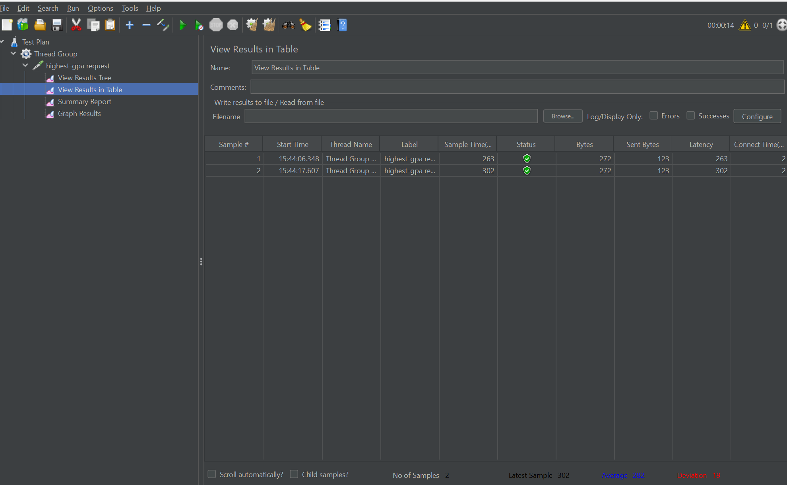

# Refleksi 5

## Jmeter Report and Result

### Test Plan 1 in GUI

### Test Plan 2 in GUI

### Test Plan 3 in GUI

### JMeter Test Result from CLI Mode

### Proof for Reaching 20% Performance Increase

First Endpoint

before

after

Second Endpoint

before

after

Third Endpoint

before

after

### JMeter Result after Optimizing

### conclusion

Setelah melakukan profiling dan mengoptimalkan aplikasi, saya menjalankan kembali uji performa menggunakan JMeter. Hasilnya menunjukkan adanya peningkatan dibandingkan pengukuran awal seperti pada elapsed time menurun drastis, yang berarti permintaan diproses jauh lebih cepat. Kemudian, latensi juga berkurang, yang menunjukkan bahwa respons dikirim lebih cepat. 

Peningkatan tersebut menunjukkan bahwa optimasi yang dilakukan berhasil menghilangkan bottleneck dan meningkatkan efisiensi keseluruhan aplikasi. Dengan menganalisis data profiling, saya dapat mengidentifikasi operasi yang lambat dan mengoptimalkannya, yang mengarah pada hasil performa yang jauh lebih baik.

> What is the difference between the approach of performance testing with JMeter and profiling with IntelliJ Profiler in the context of optimizing application performance?

Dalam konteks performa optimasi, JMeter digunakan untuk mensimulasikan beban dari banyak pengguna secara bersamaan guna mengukur respons dan kestabilan sistem, sedangkan IntelliJ Profiler difokuskan untuk menganalisis secara mendalam kinerja internal aplikasi dengan mengidentifikasi fungsi-fungsi yang menjadi bottleneck dan mengukur waktu eksekusi masing-masing fungsi.

> How does the profiling process help you in identifying and understanding the weak points in your application?

Proses profiling membantu mengidentifikasi dan memahami titik-titik lemah dalam aplikasi dengan memberikan informasi detail mengenai penggunaan sumber daya, seperti waktu CPU yang dihabiskan oleh setiap fungsi serta metrik performa lainnya, sehingga memudahkan kita untuk menentukan fungsi mana yang memerlukan optimasi agar performa aplikasi dapat ditingkatkan secara keseluruhan.

> Do you think IntelliJ Profiler is effective in assisting you to analyze and identify bottlenecks in your application code?
 
Profiling membantu mengidentifikasi titik lemah dengan menampilkan data real-time mengenai kinerja masing-masing metode, penggunaan CPU, dan konsumsi memori, sehingga memudahkan pendeteksian masalah seperti query lambat atau kebocoran memori serta mengukur perbaikan setelah optimasi.

>What are the main challenges you face when conducting performance testing and profiling, and how do you overcome these challenges?

Tantangan utama dalam pengujian performa dan profiling adalah menentukan fokus di tengah banyaknya data yang dihasilkan dan mensimulasikan trafik yang realistis, ditambah lagi dengan menjaga keseimbangan antara optimasi dan kemudahan pemeliharaan kode. Karena itulah saya menerapkan pendekatan bertahap mulai dari identifikasi endpoint lambat hingga optimasi bagian yang paling bermasalah tanpa mengorbankan fungsionalitas.

> What are the main benefits you gain from using IntelliJ Profiler for profiling your application code?

Keuntungan utama menggunakan IntelliJ Profiler adalah integrasinya yang mulus dengan lingkungan pengembangan IntelliJ, yang memungkinkan analisis performa dilakukan secara langsung tanpa harus membuka aplikasi pihak ketiga, sehingga memudahkan dan mempercepat proses identifikasi serta penyelesaian masalah performa pada kode aplikasi.

> How do you handle situations where the results from profiling with IntelliJ Profiler are not entirely consistent with findings from performance testing using JMeter?

Dari hasil yang saya dapat, saat hasil profiling tidak konsisten dengan pengujian JMeter, saya menyadari bahwa tidak semua masalah performa berasal dari kode, melainkan juga bisa disebabkan oleh faktor eksternal seperti database lock atau latensi jaringan. Oleh karena itu, saya memeriksa log database dan menguji dalam kondisi berbeda untuk memastikan penyebab masalah.

> What strategies do you implement in optimizing application code after analyzing results from performance testing and profiling? How do you ensure the changes you make do not affect the application's functionality?

Strategi optimasi yang saya terapkan setelah menganalisis hasil pengujian performa dan profiling meliputi penggunaan fungsi-fungsi bawaan Java yang lebih efisien, seperti metode pencarian untuk semua dengan `findAll()`, dsb.
